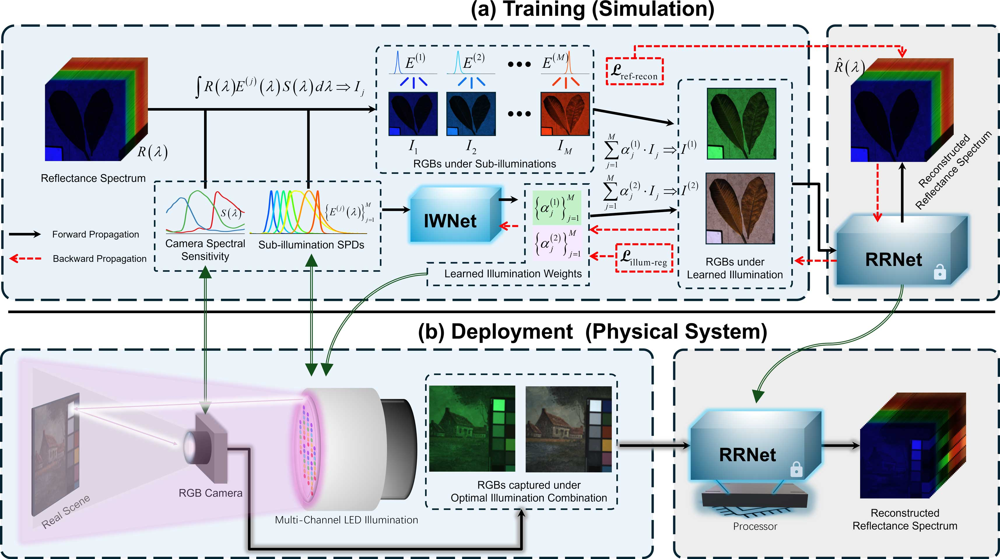

# SRR-RDII
# Spectral Reflectance Imaging with Dual-Illumination and RGB Camera via Regularized End-to-End Learning

## 📄 Paper Information

**Title**: Spectral Reflectance Imaging with Dual-Illumination and RGB Camera via Regularized End-to-End Learning  
**Authors**: Hao Sha1,2, Jeroen Cerpentier2, Shining Ma1, Pengjie Zhao1, Yue Liu1,3,\*, Yongtian Wang1, Youri Meuret2  
**Affiliations**:  
1 School of Optics and Photonics, Beijing Institute of Technology, China  
2 Department of Electrical Engineering (ESAT), KU Leuven, Belgium  
3 Zhengzhou Research Institute of Beijing Institute of Technology, China  

  

## 💻 Code Availability

The source code is currently under final organization and will be released **soon**.

---

## 🎬 Result Demonstration

We provide a short video demonstrating our system's spectral reflectance reconstruction and relighting results.  
[👉 Click to watch the video](figs/demo.mp4)

> The video illustrates:  
> - Spectral reflectance recovery from RGB inputs  
> - Dual-illumination acquisition setup  
> - Dynamic relighting with estimated reflectance

---

## 📬 Contact

If you are interested in this work or would like early collaboration:

- Hao Sha: sh15271201@163.com  

